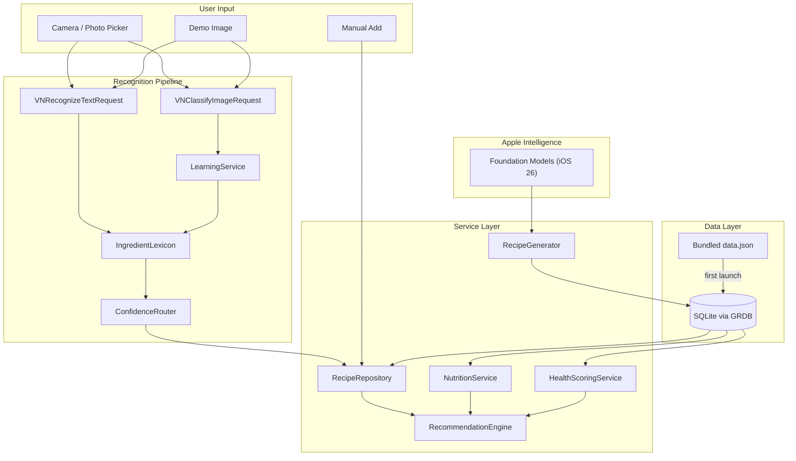
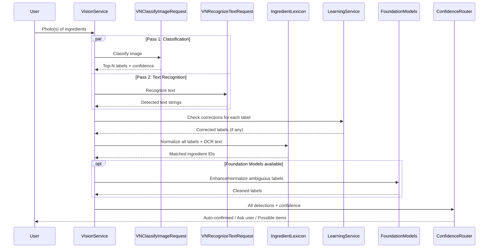
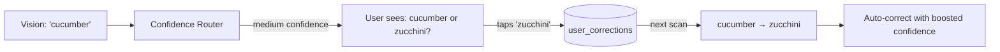
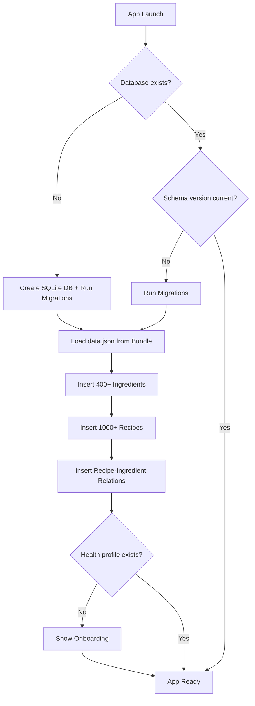

# FridgeLuck Optimized Data Architecture

## Size Budget Analysis

With aggressive optimization, the full feature set fits comfortably in 25MB:

| Component                   | Estimated Size    |
| --------------------------- | ----------------- |
| GRDB.swift (SQLite wrapper) | ~400-600KB        |
| Bundled recipes (1000+)     | ~120KB compressed |
| Ingredients (400+)          | ~30KB compressed  |
| Demo images (2)             | ~600KB            |
| Sprites/assets              | ~200KB            |
| Swift code                  | ~200KB            |
| **Total**                   | **~1.6-1.8MB**    |

This leaves 23+ MB headroom. Recipes are slightly larger now because they include per-ingredient quantities in grams (needed for macro computation), but still negligible.

---

## Core Architecture



---

## 1. Vision Pipeline (Detailed)

### What VNClassifyImageRequest Actually Does

Apple's `VNClassifyImageRequest` has a 1,303-label taxonomy that includes ~150+ food items (egg, apple, broccoli, carrot, cheese, garlic, mushroom, onion, pasta, pepper_veggie, etc.). However, it classifies the **whole image** — it does not detect or segment individual objects.

**Implication:** A wide fridge photo will return scene-level labels like "kitchen", "food", "refrigerator." A close-up of an egg carton will correctly return "egg" with high confidence.

### Multi-Pass Pipeline



### UX Design for Accurate Detection

Since VNClassifyImageRequest works best on individual items:

- **Primary UX:** Encourage users to take 2-3 close-up photos of ingredient groups (not one wide fridge shot). Show prompt: "Take a photo of a few ingredients at a time for best results."
- **Alternative:** Allow one wide shot but set expectations that some items may need manual confirmation.
- **Manual add:** Always available as a search/type fallback.
- **Demo Mode:** Uses a pre-staged photo of 4-6 clearly visible ingredients on a counter. This ensures Vision returns reliable results for judges.

### VisionService Implementation

```swift
class VisionService {
    private let learningService: LearningService
    private let lexicon: IngredientLexicon

    struct ScanResult {
        let detections: [Detection]
        let rawClassifications: [VNClassificationObservation]
        let ocrText: [String]
    }

    func scan(image: CGImage) async throws -> ScanResult {
        // Run both Vision passes concurrently
        async let classifications = classifyImage(image)
        async let textObservations = recognizeText(image)

        let (classResults, ocrResults) = try await (classifications, textObservations)

        // Process classifications: filter to food-related, apply corrections
        var detections: [Detection] = []

        for obs in classResults where obs.confidence > 0.1 {
            var label = obs.identifier

            // 1. Check user corrections (highest priority — continual learning)
            if let corrected = learningService.correctedLabel(for: label) {
                label = corrected
            }

            // 2. Normalize with lexicon (synonyms, plurals, snake_case → readable)
            guard let ingredientId = lexicon.resolve(label) else { continue }

            detections.append(Detection(
                ingredientId: ingredientId,
                label: lexicon.displayName(for: ingredientId),
                confidence: obs.confidence,
                source: .vision,
                originalVisionLabel: obs.identifier
            ))
        }

        // Process OCR text: look for ingredient names in recognized text
        let ocrStrings = ocrResults.compactMap { $0.topCandidates(1).first?.string }
        for text in ocrStrings {
            if let ingredientId = lexicon.resolveFromText(text) {
                detections.append(Detection(
                    ingredientId: ingredientId,
                    label: lexicon.displayName(for: ingredientId),
                    confidence: 0.85, // OCR text matches are generally reliable
                    source: .ocr,
                    originalVisionLabel: text
                ))
            }
        }

        // Deduplicate (same ingredient from both vision + OCR)
        let deduplicated = deduplicateDetections(detections)

        return ScanResult(
            detections: deduplicated,
            rawClassifications: classResults,
            ocrText: ocrStrings
        )
    }

    private func classifyImage(_ image: CGImage) async throws -> [VNClassificationObservation] {
        try await withCheckedThrowingContinuation { continuation in
            let request = VNClassifyImageRequest { request, error in
                if let error { continuation.resume(throwing: error); return }
                let results = request.results as? [VNClassificationObservation] ?? []
                continuation.resume(returning: results)
            }
            let handler = VNImageRequestHandler(cgImage: image)
            try? handler.perform([request])
        }
    }

    private func recognizeText(_ image: CGImage) async throws -> [VNRecognizedTextObservation] {
        try await withCheckedThrowingContinuation { continuation in
            let request = VNRecognizeTextRequest { request, error in
                if let error { continuation.resume(throwing: error); return }
                let results = request.results as? [VNRecognizedTextObservation] ?? []
                continuation.resume(returning: results)
            }
            request.recognitionLevel = .accurate
            let handler = VNImageRequestHandler(cgImage: image)
            try? handler.perform([request])
        }
    }
}
```

### IngredientLexicon (Code, Not JSON)

Synonym mapping lives in Swift code — it's logic, not data:

```swift
enum IngredientLexicon {
    // Maps Vision taxonomy labels and common variations → ingredient DB ID
    private static let labelToId: [String: Int] = [
        // Vision taxonomy labels (snake_case)
        "egg": 1, "fried_egg": 1,
        "apple": 2,
        "bell_pepper": 3, "pepper_veggie": 3, "habanero": 3, "jalapeno": 3,
        "broccoli": 4,
        "carrot": 5,
        "cheese": 6,
        "chicken": 7, "grilled_chicken": 7, "fried_chicken": 7,
        "rice": 8, "grain": 8,
        "onion": 9,
        "garlic": 10,
        "tomato": 11,
        "mushroom": 12,
        "pasta": 13,
        "potato": 14,
        "lettuce": 15,
        // ... ~400 mappings covering all Vision food labels + common synonyms
    ]

    // Synonym normalization for OCR text and user input
    private static let synonyms: [String: String] = [
        "eggs": "egg",
        "large egg": "egg",
        "capsicum": "bell_pepper",
        "scallion": "green_onion",
        "spring onion": "green_onion",
        "greek yogurt": "yogurt",
        "cheddar": "cheese",
        "mozzarella": "cheese",
        "2% milk": "milk",
        "whole milk": "milk",
        // ... ~200 additional synonyms
    ]

    static func resolve(_ label: String) -> Int? {
        let normalized = label.lowercased()
            .replacingOccurrences(of: "_", with: " ")
            .trimmingCharacters(in: .whitespaces)

        // Direct lookup first
        if let id = labelToId[normalized] { return id }

        // Try synonym mapping
        if let canonical = synonyms[normalized], let id = labelToId[canonical] {
            return id
        }

        // Try singular form (basic pluralization)
        let singular = normalized.hasSuffix("es")
            ? String(normalized.dropLast(2))
            : normalized.hasSuffix("s")
                ? String(normalized.dropLast())
                : normalized
        return labelToId[singular]
    }

    static func resolveFromText(_ ocrText: String) -> Int? {
        // Search for known ingredient names within OCR text
        let lowered = ocrText.lowercased()
        for (name, id) in labelToId {
            if lowered.contains(name.replacingOccurrences(of: "_", with: " ")) {
                return id
            }
        }
        return nil
    }
}
```

### Confidence Router (Unchanged from context.md)

```swift
struct Detection {
    let ingredientId: Int
    let label: String
    let confidence: Float
    let source: DetectionSource  // .vision, .ocr, .manual
    let originalVisionLabel: String

    enum DetectionSource { case vision, ocr, manual }
}

enum DetectionCategory {
    case autoConfirm
    case askUser(alternatives: [String])
    case possibleItem
}

func categorize(_ detection: Detection) -> DetectionCategory {
    switch detection.confidence {
    case 0.65...: return .autoConfirm
    case 0.35..<0.65: return .askUser(alternatives: []) // filled from top-N
    default: return .possibleItem
    }
}
```

---

## 2. Compact Bundled Data Format

### Recipe Format (Array-Based, With Quantities)

Each ingredient reference is now a pair: `[ingredient_id, quantity_grams]`. This is essential for macro computation.

```json
{
  "recipes": [
    [
      1,
      "Egg Fried Rice",
      15,
      2,
      [
        [1, 100],
        [8, 200],
        [3, 15]
      ],
      [
        [9, 30],
        [21, 5]
      ],
      "1. Beat eggs\n2. Heat oil\n3. Fry rice\n4. Season",
      5
    ],
    [
      2,
      "Simple Omelette",
      10,
      1,
      [
        [1, 150],
        [6, 30]
      ],
      [
        [12, 20],
        [22, 5]
      ],
      "1. Whisk eggs\n2. Melt butter\n3. Pour and fold",
      9
    ]
  ],
  "ingredients": {
    "1": [
      "egg",
      155,
      13.0,
      1.1,
      11.0,
      0.0,
      0.0,
      0.124,
      "1 large (50g)",
      "Refrigerate, 3 weeks"
    ],
    "8": [
      "rice",
      130,
      2.7,
      28.0,
      0.3,
      0.4,
      0.0,
      0.001,
      "1 cup cooked (158g)",
      "Airtight container"
    ],
    "3": [
      "soy_sauce",
      8,
      1.3,
      0.8,
      0.0,
      0.0,
      0.4,
      5.493,
      "1 tbsp (15ml)",
      "Refrigerate after opening"
    ]
  },
  "tags": [
    "quick",
    "vegetarian",
    "vegan",
    "asian",
    "breakfast",
    "budget",
    "comfort",
    "mediterranean",
    "mexican",
    "high_protein",
    "low_carb",
    "one_pot"
  ]
}
```

**Recipe array positions:** `[id, title, time_minutes, servings, required_ingredients, optional_ingredients, instructions, tag_bitmask]`

- `required_ingredients` and `optional_ingredients` are arrays of `[ingredient_id, quantity_grams]` pairs

**Ingredient array positions:** `[name, cal_per_100g, protein, carbs, fat, fiber, sugar, sodium_g, typical_unit, storage_tip]`

- All nutrition values are per 100g (standard reference)
- Sodium in grams per 100g (not milligrams, for consistency)

**Tag bitmask:** Integer where each bit maps to the `tags` array index (e.g., `5` = bits 0+2 = "quick" + "vegan")

### Swift Decoding

```swift
struct BundledRecipeRaw {
    // Decoded from positional array
    let id: Int
    let title: String
    let timeMinutes: Int
    let servings: Int
    let requiredIngredients: [(ingredientId: Int, grams: Double)]
    let optionalIngredients: [(ingredientId: Int, grams: Double)]
    let instructions: String
    let tagBitmask: Int
}

struct BundledIngredientRaw {
    let name: String
    let caloriesPer100g: Double
    let proteinPer100g: Double
    let carbsPer100g: Double
    let fatPer100g: Double
    let fiberPer100g: Double
    let sugarPer100g: Double
    let sodiumPer100g: Double  // grams
    let typicalUnit: String
    let storageTip: String
}
```

---

## 3. SQLite Schema (GRDB)

### Database Tables

```sql
-- Recipes (bundled + user-created + AI-generated)
CREATE TABLE recipes (
    id INTEGER PRIMARY KEY,
    title TEXT NOT NULL,
    time_minutes INTEGER NOT NULL,
    servings INTEGER NOT NULL DEFAULT 1,
    instructions TEXT NOT NULL,
    tags INTEGER DEFAULT 0,
    source TEXT DEFAULT 'bundled',  -- 'bundled', 'user', 'ai_generated'
    created_at TIMESTAMP DEFAULT CURRENT_TIMESTAMP
);

-- Ingredients with full nutrition data per 100g
CREATE TABLE ingredients (
    id INTEGER PRIMARY KEY,
    name TEXT UNIQUE NOT NULL,
    calories REAL NOT NULL,         -- kcal per 100g
    protein REAL NOT NULL,          -- grams per 100g
    carbs REAL NOT NULL,            -- grams per 100g
    fat REAL NOT NULL,              -- grams per 100g
    fiber REAL NOT NULL DEFAULT 0,  -- grams per 100g
    sugar REAL NOT NULL DEFAULT 0,  -- grams per 100g
    sodium REAL NOT NULL DEFAULT 0, -- grams per 100g
    typical_unit TEXT,              -- e.g. "1 large (50g)"
    storage_tip TEXT
);

-- Recipe-Ingredient relationships WITH quantities
CREATE TABLE recipe_ingredients (
    recipe_id INTEGER REFERENCES recipes(id) ON DELETE CASCADE,
    ingredient_id INTEGER REFERENCES ingredients(id),
    is_required BOOLEAN NOT NULL DEFAULT 1,
    quantity_grams REAL NOT NULL,         -- grams used in recipe (for macro calc)
    display_quantity TEXT NOT NULL,       -- human-readable: "2 large eggs", "1 cup"
    PRIMARY KEY (recipe_id, ingredient_id)
);

-- Continual learning: user corrections for Vision labels
CREATE TABLE user_corrections (
    id INTEGER PRIMARY KEY,
    vision_label TEXT NOT NULL,         -- what Vision returned
    corrected_ingredient_id INTEGER REFERENCES ingredients(id),
    correction_count INTEGER DEFAULT 1, -- frequency (higher = more confident)
    last_used_at TIMESTAMP DEFAULT CURRENT_TIMESTAMP,
    UNIQUE(vision_label, corrected_ingredient_id)
);

-- User health profile (set during onboarding, single row)
CREATE TABLE health_profile (
    id INTEGER PRIMARY KEY DEFAULT 1 CHECK (id = 1),  -- enforce single row
    goal TEXT DEFAULT 'general',       -- 'weight_loss', 'muscle_gain', 'maintenance', 'general'
    daily_calories INTEGER,            -- target kcal/day (NULL = no target)
    protein_pct REAL DEFAULT 0.30,     -- target macro split (must sum to ~1.0)
    carbs_pct REAL DEFAULT 0.40,
    fat_pct REAL DEFAULT 0.30,
    dietary_restrictions TEXT DEFAULT '[]', -- JSON array: ["vegetarian", "gluten_free"]
    allergen_ingredient_ids TEXT DEFAULT '[]', -- JSON array of ingredient IDs to exclude
    updated_at TIMESTAMP DEFAULT CURRENT_TIMESTAMP
);

-- Cooking history for personalization + streaks
CREATE TABLE cooking_history (
    id INTEGER PRIMARY KEY,
    recipe_id INTEGER REFERENCES recipes(id),
    cooked_at TIMESTAMP DEFAULT CURRENT_TIMESTAMP,
    rating INTEGER CHECK (rating BETWEEN 1 AND 5)  -- NULL if not rated
);

-- Badges earned
CREATE TABLE badges (
    id TEXT PRIMARY KEY,
    earned_at TIMESTAMP DEFAULT CURRENT_TIMESTAMP
);

-- Daily streak tracking
CREATE TABLE streaks (
    date TEXT PRIMARY KEY,  -- ISO date: "2026-02-08"
    meals_cooked INTEGER DEFAULT 0
);

-- Indexes for query performance
CREATE INDEX idx_ri_ingredient ON recipe_ingredients(ingredient_id);
CREATE INDEX idx_ri_recipe ON recipe_ingredients(recipe_id);
CREATE INDEX idx_corrections_label ON user_corrections(vision_label);
CREATE INDEX idx_history_recipe ON cooking_history(recipe_id);
CREATE INDEX idx_history_date ON cooking_history(cooked_at);
```

---

## 4. Macro Calculation Service

### Core Logic

Per-recipe macros are computed from ingredients, not stored. This ensures accuracy and avoids data duplication.

```swift
struct RecipeMacros {
    let caloriesPerServing: Double
    let proteinPerServing: Double   // grams
    let carbsPerServing: Double     // grams
    let fatPerServing: Double       // grams
    let fiberPerServing: Double     // grams
    let sugarPerServing: Double     // grams
    let sodiumPerServing: Double    // milligrams (converted for display)
}

class NutritionService {
    private let db: DatabaseQueue

    /// Compute macros for a recipe from its ingredient quantities
    func macros(for recipeId: Int) throws -> RecipeMacros {
        try db.read { db in
            // Fetch recipe servings
            let servings = try Double.fetchOne(db, sql:
                "SELECT servings FROM recipes WHERE id = ?",
                arguments: [recipeId]
            ) ?? 1.0

            // Fetch all ingredients with their quantities
            let rows = try Row.fetchAll(db, sql: """
                SELECT i.calories, i.protein, i.carbs, i.fat,
                       i.fiber, i.sugar, i.sodium,
                       ri.quantity_grams
                FROM recipe_ingredients ri
                JOIN ingredients i ON i.id = ri.ingredient_id
                WHERE ri.recipe_id = ?
                """, arguments: [recipeId])

            // Sum: (nutrient_per_100g / 100) * quantity_grams
            var totalCal = 0.0, totalPro = 0.0, totalCarb = 0.0
            var totalFat = 0.0, totalFib = 0.0, totalSug = 0.0, totalSod = 0.0

            for row in rows {
                let grams: Double = row["quantity_grams"]
                let factor = grams / 100.0

                totalCal  += row["calories"] as Double * factor
                totalPro  += row["protein"]  as Double * factor
                totalCarb += row["carbs"]    as Double * factor
                totalFat  += row["fat"]      as Double * factor
                totalFib  += row["fiber"]    as Double * factor
                totalSug  += row["sugar"]    as Double * factor
                totalSod  += row["sodium"]   as Double * factor
            }

            return RecipeMacros(
                caloriesPerServing: totalCal / servings,
                proteinPerServing:  totalPro / servings,
                carbsPerServing:    totalCarb / servings,
                fatPerServing:      totalFat / servings,
                fiberPerServing:    totalFib / servings,
                sugarPerServing:    totalSug / servings,
                sodiumPerServing:   (totalSod / servings) * 1000 // convert g to mg
            )
        }
    }

    /// Macro breakdown as percentages (for display as pie chart or bar)
    func macroSplit(for macros: RecipeMacros) -> (proteinPct: Double, carbsPct: Double, fatPct: Double) {
        let proteinCal = macros.proteinPerServing * 4  // 4 cal/g protein
        let carbsCal   = macros.carbsPerServing * 4    // 4 cal/g carbs
        let fatCal     = macros.fatPerServing * 9       // 9 cal/g fat
        let total      = proteinCal + carbsCal + fatCal

        guard total > 0 else { return (0.33, 0.33, 0.33) }
        return (proteinCal / total, carbsCal / total, fatCal / total)
    }
}
```

---

## 5. Health Rating System

### Onboarding Flow

During first launch (or accessible from settings), the user completes a lightweight health profile:

1. **Goal selection** — "What's your focus?" (buttons, single choice)

- General health / Weight loss / Muscle gain / Maintenance

1. **Dietary restrictions** — "Any dietary preferences?" (multi-select chips)

- Vegetarian, Vegan, Gluten-free, Dairy-free, Nut-free, Halal, Kosher

1. **Allergies** — "Anything to avoid?" (search + select ingredients)

- Maps to specific ingredient IDs stored in `allergen_ingredient_ids`

1. **Daily calorie target** (optional, with smart defaults)

- Weight loss: suggest 1500-1800
- Muscle gain: suggest 2200-2800
- General: suggest 2000
- "Skip" option — no target

This data populates the single-row `health_profile` table.

### Health Score Algorithm

Each recipe gets a 1-5 health rating relative to the user's goals:

```swift
class HealthScoringService {
    private let nutritionService: NutritionService
    private let db: DatabaseQueue

    struct HealthScore {
        let rating: Int          // 1-5 stars
        let label: String        // "Great match", "Good", "Moderate", "Indulgent", "Not aligned"
        let reasoning: String    // "High protein, moderate calories"
    }

    func score(recipeId: Int) throws -> HealthScore {
        let macros = try nutritionService.macros(for: recipeId)
        let profile = try fetchHealthProfile()

        var points: Double = 0
        let maxPoints: Double = 100

        // 1. Calorie alignment (0-30 points)
        if let targetCal = profile.dailyCalories {
            let mealTarget = Double(targetCal) / 3.0  // assume 3 meals/day
            let ratio = macros.caloriesPerServing / mealTarget
            switch ratio {
            case 0.7...1.1:  points += 30  // within range
            case 0.5..<0.7:  points += 20  // slightly under
            case 1.1..<1.4:  points += 15  // slightly over
            default:         points += 5   // far off
            }
        } else {
            points += 20  // no target = neutral score
        }

        // 2. Macro balance alignment (0-40 points)
        let split = nutritionService.macroSplit(for: macros)
        let proteinDiff = abs(split.proteinPct - profile.proteinPct)
        let carbsDiff   = abs(split.carbsPct - profile.carbsPct)
        let fatDiff     = abs(split.fatPct - profile.fatPct)
        let avgDiff     = (proteinDiff + carbsDiff + fatDiff) / 3.0

        // avgDiff of 0 = perfect match (40 pts), avgDiff of 0.3+ = poor (5 pts)
        points += max(5, 40 * (1 - avgDiff * 3))

        // 3. Nutritional quality bonuses (0-30 points)
        if macros.fiberPerServing >= 5 { points += 10 }     // good fiber
        if macros.sugarPerServing <= 10 { points += 10 }    // low sugar
        if macros.sodiumPerServing <= 600 { points += 10 }  // reasonable sodium

        // Convert to 1-5 rating
        let rating = min(5, max(1, Int(ceil(points / 20))))

        let labels = ["", "Not aligned", "Indulgent", "Moderate", "Good", "Great match"]
        let reasoning = buildReasoning(macros: macros, profile: profile, split: split)

        return HealthScore(rating: rating, label: labels[rating], reasoning: reasoning)
    }

    private func buildReasoning(macros: RecipeMacros, profile: HealthProfile,
                                split: (proteinPct: Double, carbsPct: Double, fatPct: Double)) -> String {
        var notes: [String] = []

        if split.proteinPct > 0.25 { notes.append("High protein") }
        if macros.caloriesPerServing < 400 { notes.append("Light meal") }
        if macros.caloriesPerServing > 700 { notes.append("Hearty portion") }
        if macros.fiberPerServing >= 5 { notes.append("Good fiber") }
        if macros.sugarPerServing > 15 { notes.append("Higher sugar") }

        return notes.joined(separator: " · ")
    }
}
```

---

## 6. Recipe Recommendation Engine

### Core Query: Find Recipes from Available Ingredients

This is the critical query — given a set of detected ingredient IDs, find recipes the user can actually make.

```swift
class RecipeRepository {
    private let db: DatabaseQueue

    struct ScoredRecipe {
        let recipe: Recipe
        let matchedRequired: Int
        let totalRequired: Int
        let matchedOptional: Int
        let macros: RecipeMacros
        let healthScore: HealthScore
        let personalScore: Double
    }

    /// Find recipes where ALL required ingredients are available
    func findMakeable(
        with availableIds: Set<Int>,
        profile: HealthProfile,
        limit: Int = 20
    ) throws -> [ScoredRecipe] {
        try db.read { db in
            // Step 1: Find recipes where every required ingredient is in availableIds
            let idList = availableIds.map(String.init).joined(separator: ",")

            let sql = """
                SELECT r.*,
                    SUM(CASE WHEN ri.is_required = 1
                         AND ri.ingredient_id IN (\(idList)) THEN 1 ELSE 0 END) as matched_req,
                    SUM(CASE WHEN ri.is_required = 1 THEN 1 ELSE 0 END) as total_req,
                    SUM(CASE WHEN ri.is_required = 0
                         AND ri.ingredient_id IN (\(idList)) THEN 1 ELSE 0 END) as matched_opt
                FROM recipes r
                JOIN recipe_ingredients ri ON r.id = ri.recipe_id
                GROUP BY r.id
                HAVING matched_req = total_req
                ORDER BY matched_req DESC, matched_opt DESC, r.time_minutes ASC
                """

            var results = try Row.fetchAll(db, sql: sql)

            // Step 2: Filter out recipes containing allergens
            let allergenIds = profile.allergenIngredientIds
            if !allergenIds.isEmpty {
                results = results.filter { row in
                    let recipeId: Int = row["id"]
                    let hasAllergen = try? Bool.fetchOne(db, sql: """
                        SELECT EXISTS(
                            SELECT 1 FROM recipe_ingredients
                            WHERE recipe_id = ? AND ingredient_id IN (\(allergenIds.map(String.init).joined(separator: ",")))
                        )
                        """, arguments: [recipeId])
                    return hasAllergen != true
                }
            }

            // Step 3: Compute macros + health score + personalization for each
            // (This happens in the service layer, not raw SQL)
            return results.prefix(limit).map { row in
                // ... map to ScoredRecipe with computed fields
            }
        }
    }

    /// "Make Something Now" — single best recipe, optimized for speed
    func quickSuggestion(with availableIds: Set<Int>, profile: HealthProfile) throws -> ScoredRecipe? {
        var candidates = try findMakeable(with: availableIds, profile: profile, limit: 5)

        // Prioritize: quick cook time + good health score + not recently made
        candidates.sort { a, b in
            let aScore = Double(a.healthScore.rating) * 10
                       - Double(a.recipe.timeMinutes)
                       + a.personalScore
            let bScore = Double(b.healthScore.rating) * 10
                       - Double(b.recipe.timeMinutes)
                       + b.personalScore
            return aScore > bScore
        }

        return candidates.first
    }
}
```

### Personalization Scoring

```swift
class PersonalizationService {
    private let db: DatabaseQueue

    func personalScore(for recipeId: Int) throws -> Double {
        try db.read { db in
            var score: Double = 0

            // Boost recipes user has cooked and liked
            if let avgRating = try Double.fetchOne(db, sql: """
                SELECT AVG(rating) FROM cooking_history
                WHERE recipe_id = ? AND rating IS NOT NULL
                """, arguments: [recipeId]) {
                score += (avgRating - 3.0) * 0.2  // 5-star → +0.4, 1-star → -0.4
            }

            // Boost same-tag recipes user frequently cooks
            let tagAffinity = try Double.fetchOne(db, sql: """
                SELECT COUNT(*) FROM cooking_history ch
                JOIN recipes r ON r.id = ch.recipe_id
                JOIN recipes target ON target.id = ?
                WHERE (r.tags & target.tags) > 0
                AND ch.cooked_at > datetime('now', '-30 days')
                """, arguments: [recipeId]) ?? 0
            score += min(0.3, tagAffinity * 0.03)

            // Penalize recently cooked (variety)
            let daysSinceLast = try Double.fetchOne(db, sql: """
                SELECT julianday('now') - julianday(MAX(cooked_at))
                FROM cooking_history WHERE recipe_id = ?
                """, arguments: [recipeId])
            if let days = daysSinceLast, days < 3 {
                score -= 0.3 * (1 - days / 3)  // linear decay
            }

            return score
        }
    }
}
```

---

## 7. Continual Learning System

### How Corrections Flow



### Implementation

```swift
class LearningService {
    private let db: DatabaseQueue

    // In-memory cache for instant lookup during active session
    private var cache: [String: (ingredientId: Int, count: Int)] = [:]

    init(db: DatabaseQueue) {
        self.db = db
        // Load all corrections into cache at init
        loadCache()
    }

    private func loadCache() {
        try? db.read { db in
            let rows = try Row.fetchAll(db, sql: """
                SELECT vision_label, corrected_ingredient_id, correction_count
                FROM user_corrections
                ORDER BY correction_count DESC
                """)
            for row in rows {
                let label: String = row["vision_label"]
                cache[label.lowercased()] = (
                    ingredientId: row["corrected_ingredient_id"],
                    count: row["correction_count"]
                )
            }
        }
    }

    /// Record a user correction
    func recordCorrection(visionLabel: String, correctedIngredientId: Int) {
        let key = visionLabel.lowercased()

        try? db.write { db in
            try db.execute(sql: """
                INSERT INTO user_corrections (vision_label, corrected_ingredient_id, correction_count, last_used_at)
                VALUES (?, ?, 1, CURRENT_TIMESTAMP)
                ON CONFLICT(vision_label, corrected_ingredient_id)
                DO UPDATE SET correction_count = correction_count + 1,
                             last_used_at = CURRENT_TIMESTAMP
                """, arguments: [key, correctedIngredientId])
        }

        // Update cache immediately
        let existing = cache[key]
        if existing == nil || correctedIngredientId != existing?.ingredientId {
            cache[key] = (ingredientId: correctedIngredientId, count: (existing?.count ?? 0) + 1)
        }
    }

    /// Look up the most frequent correction for a Vision label
    func correctedIngredientId(for visionLabel: String) -> Int? {
        let key = visionLabel.lowercased()

        // Require at least 2 corrections before auto-applying
        // (1 correction could be a mistake)
        guard let cached = cache[key], cached.count >= 2 else {
            return nil
        }
        return cached.ingredientId
    }

    /// Get the user's correction if any (even count=1), for suggesting during medium-confidence prompts
    func suggestedCorrection(for visionLabel: String) -> Int? {
        cache[visionLabel.lowercased()]?.ingredientId
    }
}
```

**Key design choice:** Auto-corrections require `count >= 2` (user corrected the same way at least twice). Single corrections only influence the suggestion order in medium-confidence prompts, not auto-behavior. This prevents one accidental tap from permanently misclassifying items.

---

## 8. Foundation Models Integration (iOS 26)

### Correct API Usage

The Foundation Models framework on iOS 26 uses `LanguageModelSession` with `@Generable` structs for structured output. The model is embedded in the OS — it adds **zero bytes** to the app.

### Recipe Generator

```swift
import FoundationModels

@available(iOS 26, macOS 26, *)
@Generable
struct GeneratedRecipe {
    @Guide(description: "A creative, appetizing recipe title")
    let title: String

    @Guide(description: "Cooking time in minutes")
    let timeMinutes: Int

    @Guide(description: "Number of servings this recipe makes")
    let servings: Int

    @Guide(description: "Step-by-step cooking instructions, numbered")
    let instructions: String

    @Guide(description: "Estimated calories per serving")
    let estimatedCaloriesPerServing: Int
}

@available(iOS 26, macOS 26, *)
class RecipeGenerator {
    private var session: LanguageModelSession

    init() {
        self.session = LanguageModelSession(instructions: """
            You are a practical home cooking assistant. Create simple, realistic recipes
            that a university student could make with basic kitchen equipment.
            Focus on taste, nutrition, and simplicity. Assume access to basic pantry
            staples (salt, pepper, oil, butter) without listing them as ingredients.
            """)
    }

    func generate(from ingredientNames: [String],
                  dietaryRestrictions: [String]) async throws -> GeneratedRecipe? {
        var prompt = "Create a recipe using these ingredients: \(ingredientNames.joined(separator: ", "))."

        if !dietaryRestrictions.isEmpty {
            prompt += " Dietary requirements: \(dietaryRestrictions.joined(separator: ", "))."
        }

        let response = try await session.respond(to: prompt, generating: GeneratedRecipe.self)
        return response.content
    }

    /// Check if Foundation Models is available on this device
    static var isAvailable: Bool {
        if #available(iOS 26, macOS 26, *) {
            return SystemLanguageModel.default.isAvailable
        }
        return false
    }
}

// Fallback for devices without Foundation Models
class RecipeGeneratorFallback {
    private let recipeRepo: RecipeRepository

    /// Simply return the best-matching bundled recipe
    func bestMatch(for ingredientIds: Set<Int>, profile: HealthProfile) throws -> Recipe? {
        try recipeRepo.findMakeable(with: ingredientIds, profile: profile, limit: 1).first?.recipe
    }
}
```

### AI-Enhanced Ingredient Normalization (Optional Enhancement)

When Vision returns ambiguous labels, Foundation Models can help disambiguate:

```swift
@available(iOS 26, macOS 26, *)
@Generable
struct NormalizedIngredient {
    @Guide(description: "The standard ingredient name in singular form")
    let name: String
    @Guide(description: "Whether this is actually a food item")
    let isFood: Bool
}

@available(iOS 26, macOS 26, *)
class AIIngredientNormalizer {
    private let session = LanguageModelSession(instructions:
        "You normalize food ingredient names. Convert to singular, common English names.")

    func normalize(_ labels: [String]) async throws -> [NormalizedIngredient] {
        let prompt = "Normalize these food labels: \(labels.joined(separator: ", ")). Filter out non-food items."
        let response = try await session.respond(to: prompt, generating: [NormalizedIngredient].self)
        return response.content
    }
}
```

**Availability pattern:** Every Foundation Models usage must be wrapped:

```swift
func enhancedNormalize(_ labels: [String]) async -> [String] {
    if #available(iOS 26, macOS 26, *), RecipeGenerator.isAvailable {
        if let normalized = try? await AIIngredientNormalizer().normalize(labels) {
            return normalized.filter(\.isFood).map(\.name)
        }
    }
    // Fallback: return labels as-is (lexicon handles basic normalization)
    return labels
}
```

---

## 9. Data Sourcing Strategy

### How to Build a 1000+ Recipe Database

**Step 1: Generate recipe candidates using an LLM (Claude/GPT)**

Prompt strategy for batch generation:

```
Generate 50 recipes that primarily use these ingredients: [eggs, rice, chicken,
onion, garlic, soy sauce, bell pepper, tomato].

For each recipe, output this exact JSON array:
[id, "Title", time_minutes, servings, [[ing_id, grams], ...], [[opt_ing_id, grams], ...], "Instructions", tag_bitmask]

Requirements:
- Use realistic gram quantities
- Diverse cuisines (Asian, Mediterranean, Mexican, American, Indian)
- Mix of quick (10-15 min) and moderate (20-45 min) cook times
- Student-friendly: minimal equipment, common techniques
```

Run this in batches of 50 across different ingredient clusters to build diversity.

**Step 2: Ingredient nutrition from USDA FoodData Central**

- Source: [https://fdc.nal.usda.gov/](https://fdc.nal.usda.gov/) (public domain / CC0)
- Download the "Foundation" or "SR Legacy" dataset
- Extract per-100g values for: calories, protein, carbs, fat, fiber, sugar, sodium
- Curate ~400-500 ingredients that cover the recipe corpus

**Step 3: Quality verification**

For each generated recipe, verify:

- All referenced ingredient IDs exist in the ingredient table
- Gram quantities are realistic (not 5000g of salt)
- Instructions are clear and numbered
- Macro calculations produce reasonable per-serving values (200-1200 kcal range)
- No duplicate titles

**Step 4: Compress and test**

- Save as `data.json` with the compact array format
- Verify file size < 200KB uncompressed, < 50KB in ZIP
- Load in Swift, run all macro calculations, spot-check values

### Recipe Coverage Goal

| Category              | Target Count | Example Ingredients               |
| --------------------- | ------------ | --------------------------------- |
| Quick meals (<15 min) | 200          | eggs, bread, cheese, canned goods |
| Asian-inspired        | 150          | rice, soy sauce, tofu, ginger     |
| Mediterranean         | 100          | olive oil, tomato, feta, chickpea |
| Mexican-inspired      | 100          | beans, tortilla, avocado, lime    |
| Breakfast             | 100          | eggs, oats, banana, yogurt        |
| Soups & stews         | 100          | potato, carrot, onion, broth      |
| Pasta dishes          | 100          | pasta, garlic, tomato, cheese     |
| Salads & bowls        | 80           | lettuce, chicken, rice, dressing  |
| Budget meals (<$3)    | 100          | rice, beans, egg, frozen veg      |
| **Total**             | **~1030**    |                                   |

(Categories overlap — a quick Asian breakfast counts in multiple buckets)

---

## 10. Project Structure

```
FridgeLuck.swiftpm/
├── Package.swift
├── Sources/FridgeLuck/
│   ├── App/
│   │   ├── FridgeLuckApp.swift
│   │   ├── AppDependencies.swift      -- DI container
│   │   └── RootView.swift
│   │
│   ├── Data/
│   │   ├── Models/
│   │   │   ├── Recipe.swift           -- Recipe, RecipeTags (OptionSet)
│   │   │   ├── Ingredient.swift
│   │   │   ├── Detection.swift        -- Detection, DetectionCategory
│   │   │   ├── HealthProfile.swift
│   │   │   └── UserProgress.swift     -- Badge, Streak
│   │   ├── Bundle/
│   │   │   └── BundledDataLoader.swift
│   │   ├── Database/
│   │   │   ├── AppDatabase.swift      -- DatabaseQueue setup + migrations
│   │   │   └── Migrations.swift
│   │   └── Repository/
│   │       ├── RecipeRepository.swift
│   │       ├── IngredientRepository.swift
│   │       └── UserDataRepository.swift
│   │
│   ├── Recognition/
│   │   ├── VisionService.swift        -- Multi-pass Vision pipeline
│   │   ├── ConfidenceRouter.swift
│   │   ├── IngredientLexicon.swift    -- Label → ingredient ID mapping
│   │   └── LearningService.swift      -- Continual learning from corrections
│   │
│   ├── Intelligence/
│   │   ├── RecipeGenerator.swift      -- @Generable + LanguageModelSession
│   │   └── AIIngredientNormalizer.swift
│   │
│   ├── Services/
│   │   ├── NutritionService.swift     -- Macro computation
│   │   ├── HealthScoringService.swift -- Per-recipe health rating
│   │   ├── RecommendationEngine.swift -- Combines matching + health + personalization
│   │   └── PersonalizationService.swift
│   │
│   ├── Features/
│   │   ├── Onboarding/               -- Health goals setup
│   │   ├── Home/
│   │   ├── Scan/
│   │   ├── Results/
│   │   ├── Recipe/
│   │   ├── Nutrition/                 -- Ingredient detail cards
│   │   └── Progress/                  -- Badges, streaks, stats
│   │
│   └── UI/
│       ├── Components/
│       │   ├── PinCard.swift
│       │   ├── PixelSpriteView.swift
│       │   └── MacroBar.swift         -- Macro breakdown visualization
│       └── Styles/
│
└── Resources/
    ├── data.json                      -- Compact bundled recipes + ingredients
    ├── demo_ingredients.jpg           -- Staged photo of 4-6 clear ingredients
    └── sprites.png                    -- Pixel art spritesheet
```

---

## 11. Package.swift

```swift
// swift-tools-version: 6.0
import PackageDescription

let package = Package(
    name: "FridgeLuck",
    platforms: [.iOS(.v26), .macOS(.v26)],  // iOS 26 (Tahoe) for Foundation Models
    products: [
        .library(name: "FridgeLuck", targets: ["FridgeLuck"])
    ],
    dependencies: [
        .package(url: "https://github.com/groue/GRDB.swift.git", from: "7.0.0")
    ],
    targets: [
        .target(
            name: "FridgeLuck",
            dependencies: [
                .product(name: "GRDB", package: "GRDB.swift")
            ],
            resources: [
                .process("Resources")
            ]
        )
    ]
)
```

**Note:** Foundation Models is a system framework — no dependency needed. Vision and NaturalLanguage are also system frameworks.

---

## 12. First Launch: Bootstrap Flow



```swift
class AppDatabase {
    private let db: DatabaseQueue

    static func setup() async throws -> AppDatabase {
        let path = try FileManager.default
            .url(for: .applicationSupportDirectory, in: .userDomainMask, appropriateFor: nil, create: true)
            .appendingPathComponent("fridgeluck.sqlite")
            .path

        let db = try DatabaseQueue(path: path)

        // Run migrations
        var migrator = DatabaseMigrator()
        migrator.registerMigration("v1_initial") { db in
            // All CREATE TABLE statements from Section 3
            try db.execute(sql: SchemaSQL.v1)
        }
        try migrator.migrate(db)

        // Bootstrap bundled data if empty
        let recipeCount = try db.read { try Int.fetchOne($0, sql: "SELECT COUNT(*) FROM recipes") ?? 0 }
        if recipeCount == 0 {
            try await loadBundledData(into: db)
        }

        return AppDatabase(db: db)
    }

    private static func loadBundledData(into db: DatabaseQueue) async throws {
        guard let url = Bundle.module.url(forResource: "data", withExtension: "json"),
              let jsonData = try? Data(contentsOf: url) else {
            fatalError("Bundled data.json not found")
        }

        let bundled = try JSONDecoder().decode(BundledData.self, from: jsonData)

        try db.write { db in
            // Insert ingredients (batch)
            for (idStr, raw) in bundled.ingredients {
                guard let id = Int(idStr) else { continue }
                try db.execute(sql: """
                    INSERT INTO ingredients (id, name, calories, protein, carbs, fat, fiber, sugar, sodium, typical_unit, storage_tip)
                    VALUES (?, ?, ?, ?, ?, ?, ?, ?, ?, ?, ?)
                    """, arguments: [id, raw.name, raw.calories, raw.protein, raw.carbs, raw.fat,
                                     raw.fiber, raw.sugar, raw.sodium, raw.typicalUnit, raw.storageTip])
            }

            // Insert recipes + relationships (batch)
            for raw in bundled.recipes {
                try db.execute(sql: """
                    INSERT INTO recipes (id, title, time_minutes, servings, instructions, tags, source)
                    VALUES (?, ?, ?, ?, ?, ?, 'bundled')
                    """, arguments: [raw.id, raw.title, raw.timeMinutes, raw.servings, raw.instructions, raw.tagBitmask])

                for (ingId, grams) in raw.requiredIngredients {
                    try db.execute(sql: """
                        INSERT INTO recipe_ingredients (recipe_id, ingredient_id, is_required, quantity_grams, display_quantity)
                        VALUES (?, ?, 1, ?, ?)
                        """, arguments: [raw.id, ingId, grams, "\(Int(grams))g"])
                }
                for (ingId, grams) in raw.optionalIngredients {
                    try db.execute(sql: """
                        INSERT INTO recipe_ingredients (recipe_id, ingredient_id, is_required, quantity_grams, display_quantity)
                        VALUES (?, ?, 0, ?, ?)
                        """, arguments: [raw.id, ingId, grams, "\(Int(grams))g"])
                }
            }
        }
    }
}
```

---

## Key Design Decisions Summary

| Decision           | Choice                          | Rationale                                                        |
| ------------------ | ------------------------------- | ---------------------------------------------------------------- |
| Persistence        | GRDB + SQLite                   | Complex joins, user data, allergen filtering, clean Swift API    |
| Bundled format     | Compact JSON arrays with grams  | Min size, includes quantities for macro computation              |
| Recognition        | Vision multi-pass + corrections | No custom model, honest confidence UX, OCR for packages          |
| Macro computation  | Computed at runtime from DB     | Always accurate, no duplication, adapts to recipe edits          |
| Health scoring     | Relative to user profile        | Personalized, not one-size-fits-all                              |
| Recipe generation  | Foundation Models @Generable    | Zero app size, structured output, offline                        |
| Fallback strategy  | Every AI feature has fallback   | Works on all devices regardless of Apple Intelligence support    |
| Platform target    | iOS 26 / macOS 26 (Tahoe)       | Foundation Models + latest Vision; matches Xcode 26 for 2026 SSC |
| Recipe count       | 1000+ achievable                | ~120KB compressed, well within 25MB                              |
| Continual learning | Frequency-weighted corrections  | 2+ corrections auto-apply; 1 only suggests                       |

---

## Risks and Mitigations

1. **Foundation Models unavailable on some judge devices**

- Mitigation: Foundation Models is ONLY used for recipe generation and label enhancement. Core flow (Vision → match → recommend) works without it. Always test with `isAvailable` check.

1. **GRDB as external dependency in SwiftPM playground**

- Mitigation: GRDB explicitly supports Swift Playgrounds and SwiftPM. Test in Playgrounds early in development. If blocked, fall back to raw SQLite3 (C API available on all Apple platforms).

1. **First-launch data loading time (1000+ recipes)**

- Mitigation: SQLite batch insert of 1000 recipes takes <1 second. Show onboarding screen during bootstrap to mask any delay.

1. **VNClassifyImageRequest not recognizing all food items**

- Mitigation: OCR pass catches packaged items; manual add is always available; demo mode uses a staged photo with known-good items; confidence UX handles uncertainty gracefully.

1. **Recipe data quality at 1000+ scale**

- Mitigation: Generate with LLM in structured format, validate all ingredient IDs exist, verify gram quantities are realistic (automated checks), spot-check macro calculations.

1. **Macro accuracy depends on gram estimates**

- Mitigation: Use standard reference quantities (USDA portions). Display with "~" approximation symbol. Better to be approximately right than precisely wrong.
